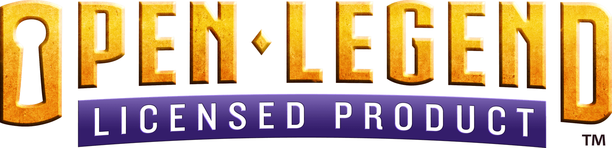
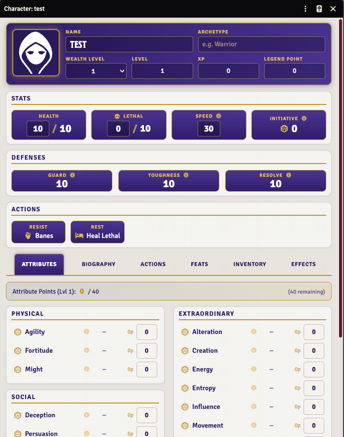
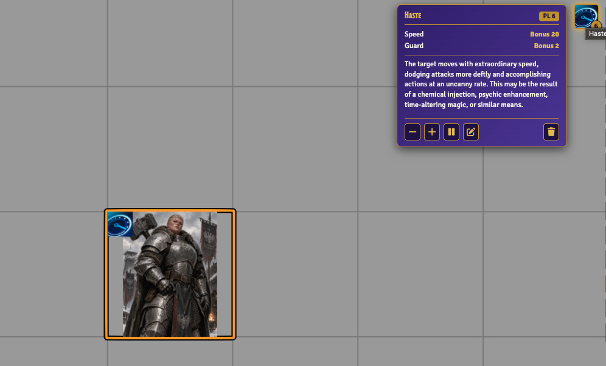
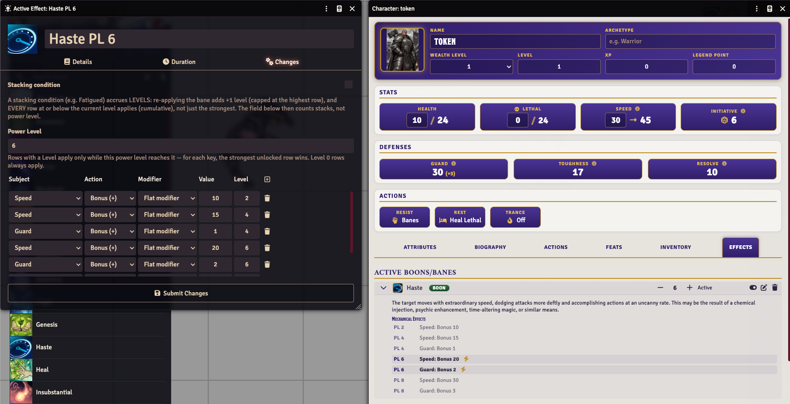

# Open Legend Unofficial — Foundry VTT System

<p align="center">
  <a href="https://foundryvtt.com/"></a>
  <a href="https://github.com/tomucato/Open-Legend-foundry-system/releases"></a>
  <a href="LICENSE"></a>
</p>

<p align="center">
  <a href="https://github.com/tomucato/Open-Legend-foundry-system/stargazers"></a>
  <a href="https://github.com/tomucato/Open-Legend-foundry-system/issues"></a>
  <a href="https://github.com/tomucato/Open-Legend-foundry-system/releases"></a>
  <a href="https://github.com/tomucato/Open-Legend-foundry-system/commits/main"></a>
  <a href="https://openlegendrpg.com/"></a>
</p>

<p align="center">
  <a href="https://openlegendrpg.com/community-license"></a>
</p>

An **unofficial, automation-heavy implementation of the [Open Legend RPG](https://openlegendrpg.com/)** for [Foundry Virtual Tabletop](https://foundryvtt.com/). Build an action once, roll it forever: exploding dice, per-target chat cards with one-click apply buttons, leveled bane/boon effects, live auras, template previews, and a long list of fully automated feats.



---

## ✨ Features

- 🎲 **Open Legend dice engine** — attribute dice with advantage/disadvantage, exploding dice, and post-roll patches for feats like Vicious Strike and legendary Unfailing items.
- ⚔️ **Actions, built once** — damaging, bane, boon, and utility actions with attribute, range, area, and damage type baked in; generate one straight from a weapon.
- 🃏 **Smart chat cards** — per-target success/failure, apply damage/bane/boon buttons, and a *Change targets* button that re-resolves the same roll against a new selection.
- 🧿 **Banes & boons as real effects** — leveled Active Effects with automatic mechanics, a PF2e-style Effects Panel on the canvas, resist rolls, and sustain/duration handling.
- 🌀 **Live auras** — boon auras draw a ring on the canvas and automatically grant boons to allies (or bane-attack enemies) that enter.
- 📐 **Areas & templates** — interactive ghost-template previews with corner snapping, chained line placement, and optional auto-targeting (friends / foes / all).
- 🤖 **Automated feats** — Battle Trance, Boon Focus, Attack Specialization, Bane Focus, Battlefield Retribution, Energy Resistance, and many more work without manual bookkeeping. See the [feats reference](TUTORIAL.md#13-automated-feats-reference).
- 🗡️ **Extraordinary & legendary items** — items that grant attributes, boons, banes, and properties while equipped; legendary properties like Intelligent, Unfailing, and Slaying.
- 🐉 **Every actor you need** — characters, NPCs, bosses, companions, minions (with the Power Level stat table), mounts/vehicles with damage thresholds, and in-place alternate forms.
- 📦 **Full compendiums** — banes, boons, feats, perks, flaws, weapons, armor, extraordinary items, effects, and utility macros.

<p align="center">
  
  
</p>

## 📥 Installation

1. In Foundry VTT, go to **Game Systems → Install System**.
2. Paste this manifest URL into the **Manifest URL** field:

   ```
   https://raw.githubusercontent.com/tomucato/Open-Legend-foundry-system/main/system.json
   ```

3. Click **Install**, then create a world using the **Open Legend Unofficial** system.

**Compatibility:** Foundry VTT v11 – v14 (verified on v14).

## 📖 Getting started

New to the system? Read the **[User Tutorial](TUTORIAL.md)** — it walks through actors, the sheet, building actions, banes & boons, areas, combat, and GM tools, with screenshots.

## 🤝 Contributing

Issues and pull requests are welcome! If you hit a bug or want a rule automated, [open an issue](https://github.com/tomucato/Open-Legend-foundry-system/issues).

## ⚖️ License

The code in this repository is released under the [MIT License](LICENSE).

**Open Legend content:** the rules text and names/descriptions of banes, boons, feats, perks, and flaws in the compendiums belong to the creators of Open Legend and are provided under the [Open Legend Community License](https://openlegendrpg.com/community-license), not MIT. This project is unofficial and is not affiliated with or endorsed by Seventh Sphere Entertainment.

### License Notice

> "This product was created under the Open Legend Community License and contains material that is copyright to Seventh Sphere Entertainment. Such use of Seventh Sphere Entertainment materials in this product is in accordance with the Open Legend Community License and shall not be construed as a challenge to the intellectual property rights reserved by Seventh Sphere Entertainment. Seventh Sphere Entertainment and Open Legend RPG and their respective logos are trademarks of Seventh Sphere Entertainment in the U.S.A. and other countries.
>
> The full-text Open Legend Community License can be found at http://www.openlegendrpg.com/community-license."
