# Open Legend (Unofficial) — User Tutorial

A practical guide to playing [Open Legend RPG](https://openlegendrpg.com/) with this Foundry VTT system. It covers making characters, rolling actions, working with banes & boons, and the automation the system runs for you.

> **Requirements:** Foundry VTT v14. All rules follow the Open Legend Community SRD.

---

## 1. Actors — who's who

Create actors from the sidebar. Six types are available:

| Type | Use for | Notes |
|---|---|---|
| **Character** | Player characters | Full sheet: attributes, feats, perks/flaws, inventory, actions, wealth, legend points. |
| **NPC** | GM creatures & allies | Slimmer sheet, same core stats. |
| **Boss** | Major villains | Has **Boss Edge**: a value added as advantage to all of its attack rolls. |
| **Companion** | A PC's animal/construct/etc. companion (from the Companion feat) | Created via the feat — see [Companions](#12-companions-minions-and-alternate-forms). |
| **Minion** | Disposable small foes | Pick a Power Level (4–9); HP and defenses come from a fixed table. Only 6 attributes, no feats or inventory. |
| **Mount / Vehicle** | Steeds, ships, mechs | GM-set stats, a Damage Threshold track, optional Immune defenses, pilot seats, and Guided/Targeted Weapons automation. |

| | |
|---|---|
| 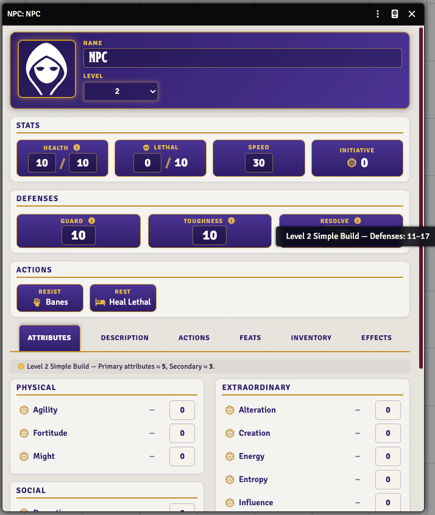 | 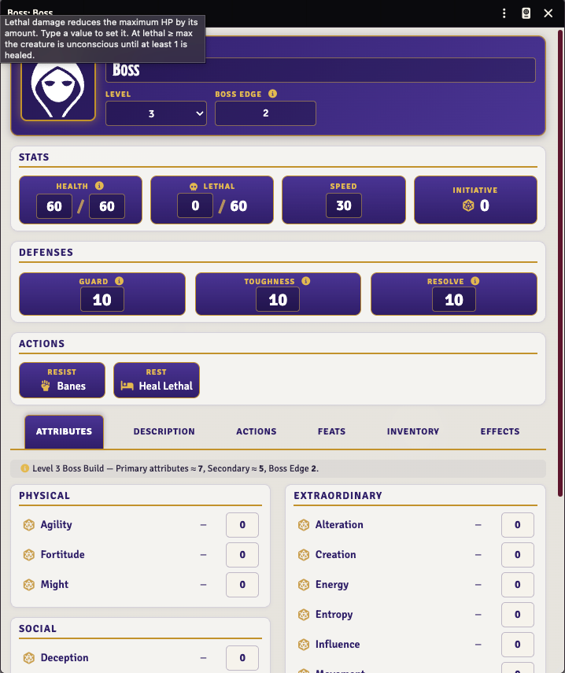 |
| *NPC — slim sheet with a level-based build advisory.* | *Boss — same, plus the Boss Edge field.* |
| 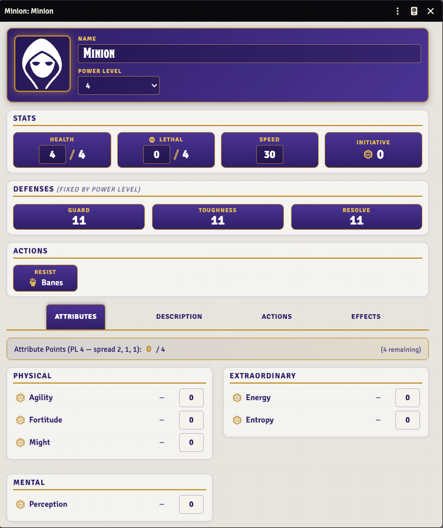 | 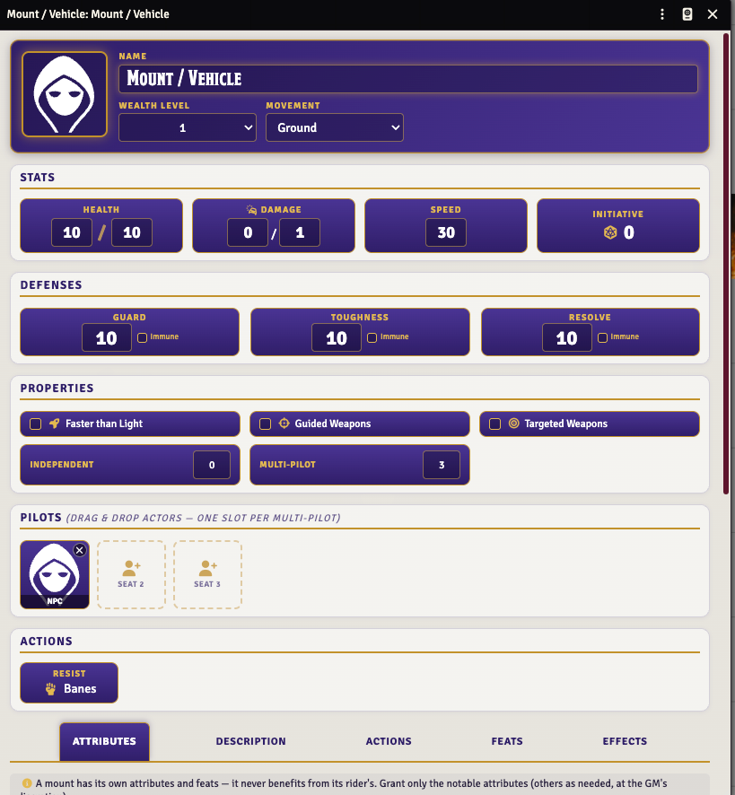 |
| *Minion — Power Level fixes HP and defenses.* | *Mount / Vehicle — pilot seats, properties, Damage Threshold.* |

## 2. The character sheet tour

**Header:** portrait, name, archetype fields, **Wealth Level**, **Legend Points** (0–10), and linked **Level** / **XP**.

**Level & XP are linked** (characters and companions): level 1 costs 0 XP, and every level after that is worth **3 XP** — so editing one field updates the other automatically (Level 2 ⇄ XP 3, Level 3 ⇄ XP 6, Level 6 ⇄ XP 15). Your point budgets scale with **XP, not just level**: **+3 attribute points and +1 feat point per XP** on top of the level-1 base (40 attribute / 6 feat). So partial-level XP counts too — at XP 5 (level 2) you have 55 attribute / 11 feat points; drop to XP 4 and it's 52 / 10. Change XP or Level and the attribute/feat pools update live.

**Left column — vitals & defenses:**

- **HP** with current / max. **Lethal damage** (see [Combat](#10-combat)) reduces your *maximum* HP; use the − / + controls next to it.
- **Guard, Toughness, Resolve** — derived from attributes, armor, and feats. Click the ⓘ icon beside any stat for a full "how was this calculated" report.
- **Speed** and **Initiative** (click the d20 to roll initiative).
- **Resist** — roll to shake off banes: 1d20 per bane, **10+ succeeds**. A **Potent** bane rolls at disadvantage 1. *Fatigued can never be removed by a resist roll.* Drag the button to the hotbar for a macro.
- **Rest** — heal lethal damage: 1 HP/day per Fortitude point (min 1), plus an attendant's best Creation/Presence/Learning. Also handles Fatigued recovery (one level per 24h of rest).
- **Hospitaler** (if you have the feat) — give targeted allies an immediate resist roll with advantage 1.
- **Battle Trance** (if you have the feat) — a toggle; while on you get its bonuses automatically.

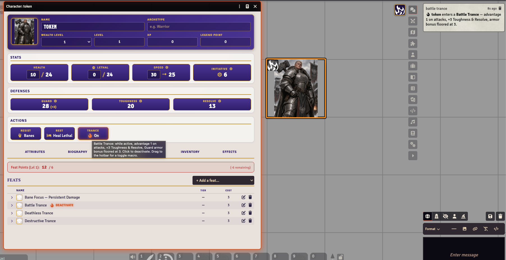
*Battle Trance on: the sheet button lights up, a chat card announces the effects, and the bonuses (Toughness/Resolve +3, Guard floor) are already folded into the derived stats.*

**Tabs:** Attributes (with roll buttons per attribute), Actions, Feats, Inventory, Effects, Biography.

**Attribute rolls:** every Open Legend roll is `1d20 + attribute dice`, and **all dice explode** (max value → roll again and add). Advantage N = roll N extra attribute dice, keep the highest set; disadvantage keeps the lowest.

## 3. Items — the building blocks

Drag items from the compendiums (sidebar → Compendium Packs) onto a sheet:

- **Weapons / Armor / Gear** — equipment. Equip armor to gain its defense bonus (Fortitude requirements apply).
- **Actions** — reusable attacks/invocations you build once and roll repeatedly (see next section).
- **Banes / Boons** — the SRD conditions. You rarely drag these to a *sheet*; they're invoked through actions or dropped onto *tokens*.
- **Feats** — many are automated; see the [reference table](#13-automated-feats-reference).
- **Perks / Flaws** — narrative traits.
- **Effects** — droppable effect carriers (GM tools like the Detection markers; drop on a token to apply their Active Effects).

**Extraordinary Items:** open a weapon/armor/gear item and flag it *Extraordinary* to give it attribute bonuses, granted banes/boons (with invoke buttons), and extraordinary properties (Area, Potent, Defensive…). Attribute grants apply while the item is equipped.

**Reading items:** compendium items open read-only as a clean stat-block. To edit, import a copy to your world/sheet first.

## 4. Actions — build once, roll forever

Create an **Action** item on your sheet (Actions tab → +). Choose its **category**:

- **Damaging attack** — attribute vs. a defense (Guard/Toughness/Resolve); deals damage equal to the margin (damage type selectable).
- **Bane attack** — attribute vs. the bane's defense; on a hit the bane afflicts the target.
- **Boon invocation** — attribute vs. the boon's Challenge Rating (CR = 10 + 2 × power level). The power level you set on the action is a **ceiling** (the most you'll attempt); after you roll, the card lets you grant the boon at **any level your roll actually reached** — so a Haste set to PL 6 that rolls short of PL 6's CR can still be taken at PL 2 or 4 via the card's PL dropdown.
- **Interrupt / utility** — plain rolls.

**Targets** options:

- **Single** — no penalty.
- **Multiple** — pick a target count; disadvantage equals the count.
- **Area** — pick a shape (cube, cone, line, sphere…); disadvantage per the SRD. Area *weapons* negate multi-target penalties.
- **Summon Monster** (Summon boons only) — pick how many creatures to summon: the first is free, each additional adds **disadvantage 2**. Summoned creatures die permanently at 0 HP and can't invoke the boon themselves.

The sheet shows a live **Dice Modifiers** breakdown (multi-target penalties, feat reductions, weapon bonuses) so you can see the roll being assembled before you click.

**Tip:** on a weapon's sheet, click **Generate Action** to auto-build a damaging/bane action preconfigured with the weapon's attribute, grip, range, area, and damage type.

## 5. Rolling & the chat card

Click an action's roll button. The **roll dialog** shows every advantage/disadvantage source itemized (action, multi-targeting, feats, Boss Edge, weapon grip…) — adjust if needed, optionally spend **Legend Points** (each = advantage 1 and +1 to the total), and roll.

The **chat card** reads top-down:

1. **Title** — the action, with a context line (attribute · weapon · vs. defense) and tag pills (Advantage 2, Vicious Strike, Martial Focus…).
2. **The dice** — Foundry's roll block.
3. **Per-target rows** — **one mini-card per targeted token** (all of them, not just the first): the **roll total** vs. their defense/CR, a signed **margin pill**, and outcome chips (damage dealt, resistance, lethal split). Green = hit/success, red = miss/fail.
4. **Apply buttons** (GM): each row has its **own** buttons, so you apply to every target independently — **Apply N damage**, **Apply <bane>**, **Grant <boon>**. A damaging hit with margin **10+** also offers **+ Bane** (a rider bane of PL ≤ your attribute).

> **Targeting more than one token:** pressing **T** targets a *single* token and clears any previous target. To target several, hold **Shift** — Shift+T on each token, or shift-left-click them — so they all stay in your target set. If the card only lists one target, you almost certainly single-targeted; re-target with Shift (or use **Change targets**). As a shortcut, if you have **nothing** targeted but several tokens *selected* (click-drag a marquee, or shift-click to select), the roll resolves against that selection instead.
5. **Change targets** — re-resolves the *same roll* against a new target selection (see below).
6. **Interrupt?** — on attack cards; opens the **Defend** dialog so a defender can roll to raise their defense against this specific attack. Out-rolling the attack turns the hit into a miss (feats like Battlefield Retribution then fire automatically).
7. **On a miss** — damaging-attack cards list each missed target with the SRD miss options: deal 3 damage, inflict a PL ≤ 3 bane, or move 10' safely.

**Drag chips:** bane/boon cards include a draggable chip — drop it on any token to apply that bane/boon at the invoked power level, or drop it on the hotbar for a reusable macro.

### Changing targets after the roll

Every action card carries a snapshot of its roll, so the GM can re-aim it without ever re-rolling:

1. Target the correct token(s) on the canvas (as usual: hover + T, or right-click → target).
2. Click **Change targets** on the card.

The card's entire target section is rebuilt in place against the new selection — the **same roll total** is compared against each new target's defense or CR, and fresh per-target rows, apply buttons, margin riders, and miss options appear. Nothing about the dice changes; only who they're measured against.

This works even when the roll was made with **no targets at all** (the card shows "no targets" with the button still there), which enables a natural area-attack flow: roll first → drag the card's template onto the scene → let **Auto-Target Area** grab the covered tokens → **Change targets**. It also cleanly fixes the classic "rolled against last round's targets" mistake. Re-targeting is GM-only and can be repeated as many times as needed — each click replaces the previous target section.

## 6. Banes

- **Applying:** via a hit bane attack (Apply button / chip), the margin-rider **+ Bane** button, or dropping a chip on a token.
- **Power-level effects:** the applied condition carries the mechanical changes for its PL and shows in the token, the sheet's Effects tab, and the Effects Panel.
- **Potent:** a bane applied as *Potent* forces resist rolls at disadvantage 1. Preselected automatically when invoking with an item that has the Potent property.
- **Resisting:** the sheet's **Resist** button, once per bane: 1d20, 10+ removes it. **Fatigued is excluded** — only rest (or Restoration) reduces it.

  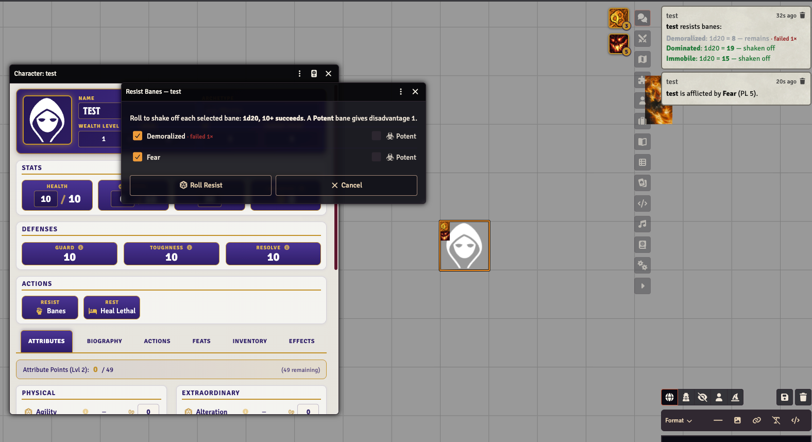
  *The Resist dialog lists each bane (with its failed-resist tally and a Potent toggle); the chat card shows which rolls shook the bane off.*

- **Failed-resist tally:** each failed resist roll is counted **per application** of that bane (`failed N×`), shown on the resist dialog, the resist chat card, and the bane's Effects Panel card. This tracks progress toward durations that end after a set number of failures (e.g. Provoked's *Fail ×3 = 1 minute*). The count is scoped to the current application: remove and re-apply the bane and it starts fresh at zero.
- **Per-turn banes:** **Persistent Damage** auto-rolls its damage at the start of the bearer's turn (see Settings) with an apply card.
- **Stacking:** **Fatigued** stacks — re-applying raises its level (the token badge shows the number).
- **Nullify:** the Nullify bane is *instantaneous*: applying it immediately prompts which boon (of legal PL) to cancel, removes it, and marks the target so the same boon can't be re-granted for 1 minute.
- **Provoked:** applying it asks *who provokes* (GM picks from all scene tokens; a player from tokens they can see) and stores the answer. From then on, the afflicted creature's attack rolls that **don't target the provoker** are automatically seeded with the bane's disadvantage (PL − 3: PL 4 → 1 … PL 9 → 6), itemized in the roll dialog; targeting the provoker clears it. Toggleable via the *Provoked Bane Automation* setting.

## 7. Boons

Invoke through a boon action. On success, **Grant** buttons/chips apply the boon per target. Special automation:

- **Heal** — instantaneous: the healing dice (fixed by PL) roll immediately with apply buttons. **Extraordinary Healing** also restores lethal damage.
- **Regeneration** — heals automatically at the start of the bearer's turn.
- **Light** — the bearer's token emits light, radius = PL × 5 ft. Removing the boon restores the token's original lighting.
- **Detection** — prompts for a phenomenon (Holy / Unholy / Life / Death / Magic). While borne, that player *sees the GM's hidden Detection Aura glows* on tokens radiating it (see [GM tools](#11-gm-tools--settings)).

  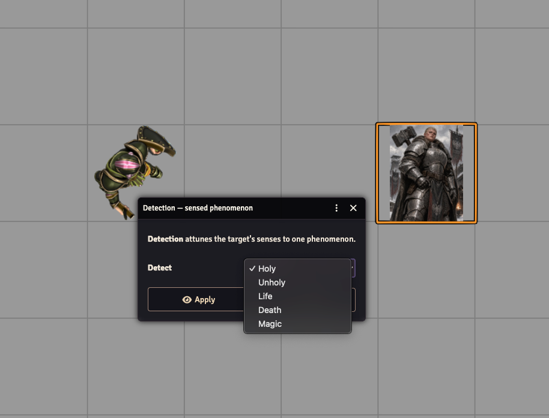

- **Invisible / Concealment** — prompts *which players can still see the bearer's token*; everyone else's client hides it (the GM always sees it). **Re-apply the boon to change the list.**

  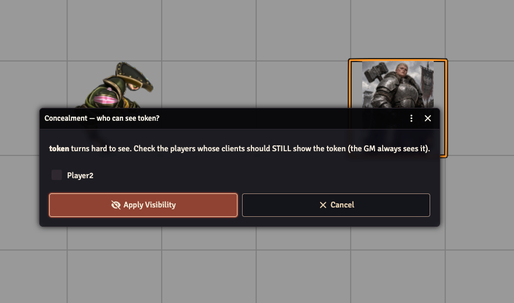
- **Resistance** — prompts for a damage type; raises the bearer's defenses vs. that type (+3/+6/+9 by PL, immune at PL 9).
- **Restoration** — instantaneous cure. Pick a **ceiling PL** on the action; after rolling, choose the level to apply from the card. All banes of PL ≤ your chosen level are cured **outright** (you don't need to have aimed high enough for the tougher banes to still clear these). The roll card lists **every** bane above your ceiling with its dispel CR (20 + 2 × PL) — the ones your roll met are marked ✓ (offered for dispel when granting, no extra roll), the ones it fell short of are shown ✗ so you can see the CR you'd have needed. **Fatigued special rules:** only one level is removed per Restoration (all levels if PL ≥ 7), and the target then can't benefit from Restoration-vs-Fatigued again for 24 hours (a marker effect the GM removes manually when time has passed).
- **Aura** — becomes a *live aura* that runs itself; see the dedicated section below.
- **Barrier** — choose its properties at grant; a Damaging barrier gets its own damage roll button.
- **Boon Focus** — single-target invocations of your focused boon *auto-succeed* with no roll; multi-target gets advantage by tier.

**Sustaining:** most lasting boons expire when their duration ends or when deleted (dropping sustain). Deleting an Aura removes everything it granted.

*A granted boon (or bane) carries **leveled** mechanical rows — the sheet's Effects tab highlights the rows unlocked at its current power level (here Haste PL 6: Speed +20, Guard +2), and the Active Effect editor shows how each row is gated by Level.*

### Live Auras

When the Aura boon is granted, it configures what the bearer **radiates** — another boon (a *boon aura*) or a bane attack (a *bane aura*) — and a radius. From then on the aura is fully automatic:

- **The ring.** Every client sees a circle drawn around the bearer's token — green for a boon aura, red for a bane aura. It measures edge-to-edge: a creature whose nearest edge is within the radius is inside, exactly matching what the drawn circle encloses. The ring follows the token as it moves.
- **Boon aura** (allies, and the bearer itself): a friendly creature that **ends its turn inside** the aura automatically gains the radiated boon — no roll, no clicking. The moment it leaves the area (any movement, on anyone's turn), the granted boon is removed. Merely walking through or standing inside mid-turn grants nothing; the SRD trigger is *ending your turn* there.
- **Bane aura** (everyone except the bearer): a creature suffers an automatic **bane attack** when it **moves into** the area, and again when it **ends its turn** inside — but at most **once per round** per creature. Passing through during a drag doesn't count; what matters is where the move lands. The attack posts a normal bane-attack card (with apply buttons and the on-a-miss options bar), rolled with the aura's configured attacking attribute.
- **Ending it.** Delete the Aura condition from the bearer (dropping sustain, Nullify, etc.) and everything it granted disappears from every ally immediately.
- **Who runs it:** all of this executes once, on the GM's client — players just see the results. Multiple auras coexist fine; each tracks its own membership.

## 8. Areas & templates

Area actions attach a **drag-to-place handle** to their chat card. Drop it on the scene to enter an interactive preview: the shape follows your cursor, **mouse wheel rotates** it, cones can alternate facing with a keybinding, and it **snaps to grid corners**. Click to commit — the area is placed as a Foundry **Region**.

**Lines** follow the SRD chaining rule: each line is a separate **5'×10'×10'** segment (two squares). Dropping a multi-line attack places them **one at a time** — move the ghost, **wheel to rotate in 45° steps** (vertical → `\` diagonal → horizontal → `/` diagonal; a diagonal covers two squares meeting corner-to-corner), click to commit, then chain the next segment from the placed ones. Every additional line must **touch a corner** of an already-placed line (diagonal corner-to-corner counts) and may not overlap one; the ghost turns **red** on an illegal spot and an illegal click is rejected. Cancelling mid-chain (Esc / right-click) keeps the lines already placed. All segments commit as a single Region.

With **Auto-Target Area** enabled (Settings), committing a template prompts *Friends / Foes / All* and targets the covered tokens for you — ready for the action roll.

## 9. The Effects Panel

A floating column of icons in the top-right of the canvas shows every active condition/effect on your selected token (or assigned character): hover for a description card and its mechanical changes, click to step a stacking condition's level, right-click to remove. Toggle it per-user in Settings ("Show Effects Panel").

*Hovering an icon shows the effect's power level, active mechanical changes, description, and quick controls (step level, pause, edit, remove).*

## 10. Combat

- **Initiative** is 1d20 (Agility-based advantage per your build; roll from the sheet or tracker).
- **Turn start:** with *Auto-Roll Turn Effects* on, the combatant's Regeneration healing and Persistent Damage rolls post automatically with apply buttons.
- **Defending:** any attack card's **Interrupt?** lets a defender roll defense as an interrupt.
- **Lethal damage** reduces **max HP** and can only be healed by resting (or Extraordinary Healing). At lethal ≥ max HP you fall unconscious. Attacks made with **Lethal Strike** deal part of their damage as lethal.

  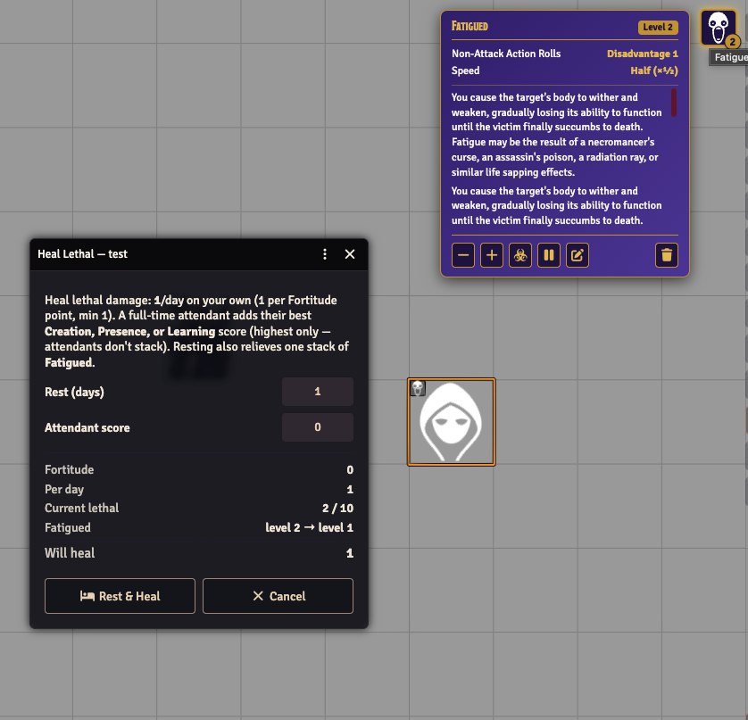
  *The Rest dialog computes the healing from Fortitude, rest days, and an attendant's score — and shows the Fatigued level it will relieve. Behind it, the Effects Panel card for a level-2 Fatigued stack.*
- **Death's door:** with **Deathless Trance**, damage can push HP negative during a Battle Trance instead of stopping at 0 — with a collapse warning when the trance ends.

## 11. GM tools & settings

**Settings (gear icon → Configure Settings → Open Legend Unofficial):**

| Setting | Scope | What it does |
|---|---|---|
| Show Effects Panel | per user | The floating condition-icons column. |
| Auto-Target Area | world | Prompt to target tokens covered by a placed area. |
| Auto-Roll Turn Effects | world | Auto-roll Regeneration / Persistent Damage at turn start. |
| Provoked Bane Automation | world | Applying Provoked asks who provokes; attacks not targeting them are seeded with the bane's disadvantage. |
| Custom Damage Types | world (menu) | Add homebrew damage types; they appear in every damage-type picker. |

**The Effects compendium** (GM utility effects — drop on tokens):

- **Detection Aura (Holy/Unholy/Life/Death/Magic)** — invisible-to-players markers that make a token radiate a phenomenon. The GM sees a colored glow; players see it only while bearing a matching Detection boon.
- **Nullify Boon Cancelation** — applied automatically by Nullify; blocks re-granting the canceled boon for 1 minute.
- **Restoration Fatigue Immunity** — applied automatically when Restoration reduces Fatigued; blocks further Restoration-vs-Fatigued until you remove it (24h in-world).

| | |
|---|---|
| 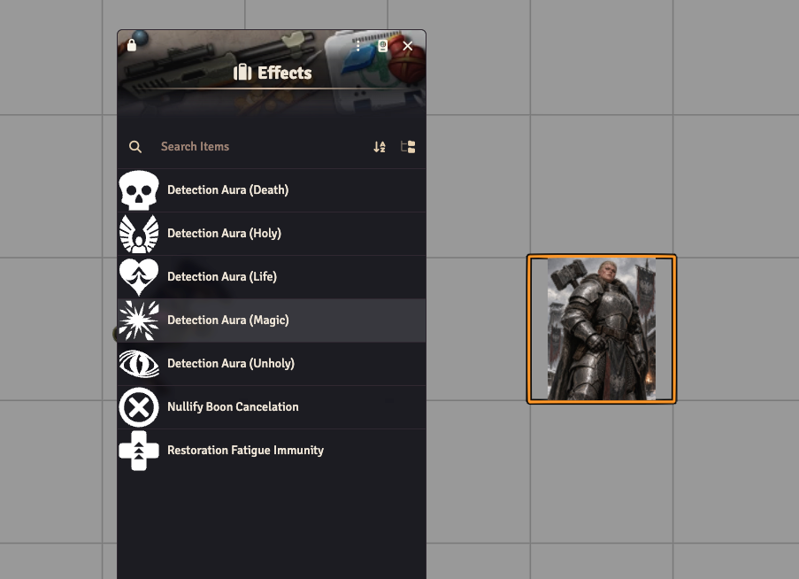 | 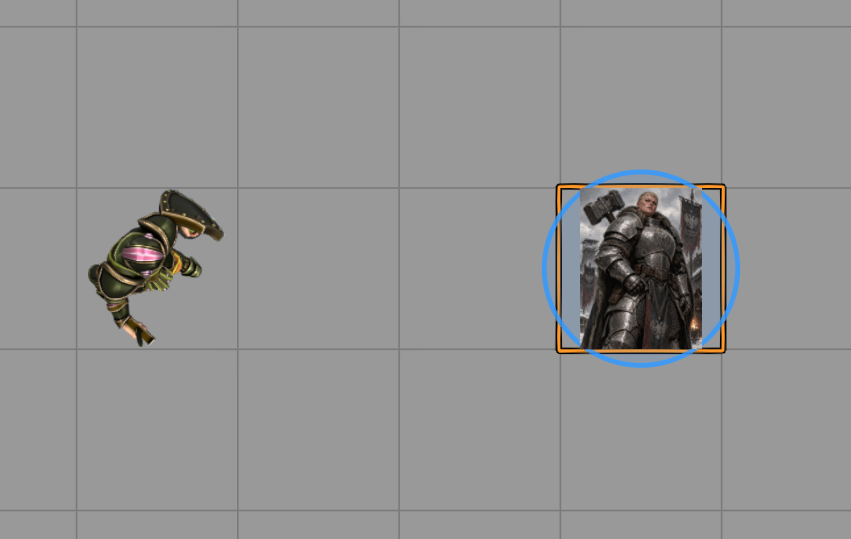 |
| *The Effects compendium — drag a marker onto a token.* | *The glow a Detection Aura adds — visible to the GM and to players bearing a matching Detection boon.* |

**Compendiums** also include: Banes, Boons, Feats, Perks, Flaws, Weapons, Armor, Extraordinary Items, and Macros (below).

### The Macros compendium

Ready-made tools — open the **Macros** compendium and run them directly, or drag them to the hotbar:

- **Asset Browser** — a six-tab browser (Banes, Boons, Feats, Perks, Flaws, Items) over the system compendiums, with per-tab filters. Click a row to open its sheet; drag it onto an actor sheet or the canvas.
- **Apply Bane / Boon** — pick any bane or boon from one grouped list, choose its power level (the options adapt to the picked entry) and Potent for banes, then apply it to **all targeted or all selected tokens** in one go. Runs the full automation pipeline — special boons still ask their questions (Detection's phenomenon, Invisible's viewer list…), instantaneous ones resolve immediately.
- **Resist All (Group)** — every chosen token rolls to shake off **every bane on it**, unprompted: 1d20 per bane, 10+ removes it, with Resilient advantage and Potent disadvantage applied per creature (Fatigued excluded, as always). One combined chat summary shows all the rolls.
- **Rest All (Group)** — rest the whole party at once: one prompt for days of rest + an optional attendant score, then each creature heals lethal damage at its own Fortitude rate and recovers one Fatigued level per day rested. One combined summary.
- **Deal Damage (Regular + Lethal)** — prompt for regular and/or lethal damage (and a type) and apply both to every targeted token.

Both group macros open with an **"Apply to: targeted / selected"** choice showing live token counts — so you can sweep a whole battlefield selection or just your target reticles.

## 12. Companions, minions, and alternate forms

- **Companion feat** → a **View Companion** button appears; it creates and links a separate Companion actor with tier-derived attribute/feat budgets shown on its sheet.
- **Minions** are quick-build foes: set Power Level, get fixed HP/defenses.
- **Alternate Form feat** (e.g. werewolf): the sheet grows a **form tab bar** (on **characters and NPCs**). Each form is its own linked actor; switching **transforms the token in place** and carries current damage over. Budget advisories are derived from your tier.

## 13. Automated feats reference

These feats work on their own once on your sheet — no manual bookkeeping:

| Feat | Automation |
|---|---|
| Attack Specialization | Advantage = tier on matching damaging attacks (weapon type or damage type). |
| Armor Mastery | +tier Guard in armor; Tier 2: −5' armor-penalty relief, Fortitude prereq −tier. |
| Attribute Substitution | Dependent attribute reads as the primary for stats (and rolls at Tier 2). **Multi-take:** link several attribute pairs (one feat each) — the same primary may feed more than one dependent. |
| Bane Focus | Advantage 2 on attacks inflicting the focused bane; margin-rider threshold 10 → 5 for it. |
| Battle Trance | Toggle: advantage 1 on attacks, Toughness/Resolve +3, Guard armor floor 3. |
| Destructive / Deathless Trance | While in trance: dice explode a step earlier / HP can go negative. |
| Battlefield Retribution | A winning Defend interrupt deals the roll difference back to the attacker. |
| Battlefield Punisher | A ≥10 retribution offers a "Punish" button afflicting your chosen bane. |
| Boon Access | Invoke the chosen boon at its bought level via an item-style invocation. |
| Boon Focus | Single-target auto-success; multi-target advantage 2/3/4+ by tier. |
| Climbing | Derived climb speed shown on the sheet. |
| Defensive Mastery / Reflexes | Better Defensive-weapon values / advantage per tier on defend rolls. |
| Energy Resistance | Matching energy attacks resolve vs. +3/6/9 defense (tier 4: immune). |
| Extraordinary Defense | +1 to all three defenses per tier. |
| Hospitaler | Sheet action: grant allies an immediate advantage-1 resist roll. |
| Inspiring Champion | Margin-10 hits surface an ally-healing roll (dice by tier). |
| Lethal Strike / Death Blow | Damage splits into lethal; Death Blow riders offered on the card. |
| Martial Focus | Attribute counts one higher for attack dice with the chosen weapon. |
| Multi-Target Attack/Boon Specialist | Reduces multi-target (and Summon) disadvantage by tier. |
| Multi-Target Boon Expert | Fully-offset multi-boon invocations with Boon Focus auto-succeed. |
| Multi-Bane Specialist | One attack applies your chosen bane pair (each resisted separately). |
| Overpowering Strike / Crushing Blow | Forceful-weapon hits offer 5' push (and Knockdown) buttons. |
| Reckless Attack | Sheet action: advantage now, vulnerable until next turn (self-card). |
| Resilient | Advantage 1 on all resist rolls (offsets Potent). |
| Two Weapon Brute | Dual-wield grip bonuses on the roll dialog. |
| Vicious Strike | Natural 20 → explosion re-rolls made with advantage. |

## 14. Handy habits

- **Drag to hotbar:** attribute rolls, actions, Resist, Hospitaler, Battle Trance, and bane/boon chips all become macros.
- **Target first:** select your targets *before* rolling (or fix it after with **Change targets**).
- **Hover the ⓘ:** every derived stat explains itself.
- **Let the card drive:** after a roll, everything applicable — damage, banes, boons, defends, miss options, riders — is a button on the chat card. If you're clicking through sheets mid-combat, there's probably a button you missed.
